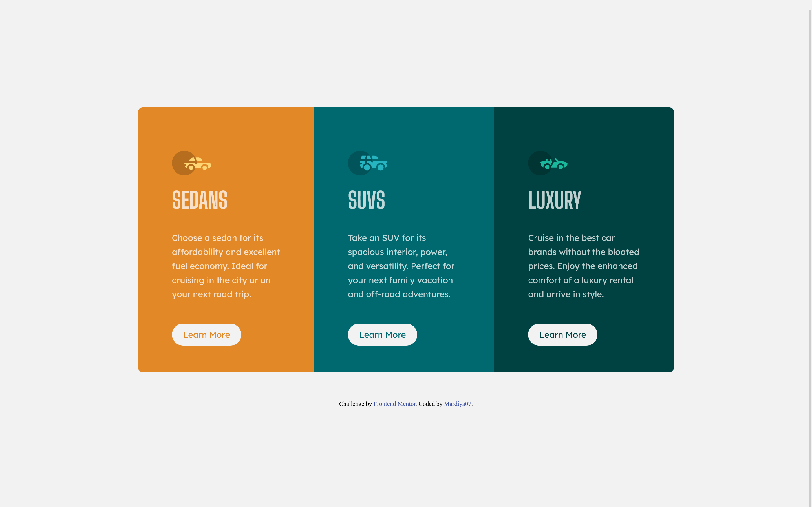

# Frontend Mentor - 3-column preview card component solution

This is a solution to the [3-column preview card component challenge on Frontend Mentor](https://www.frontendmentor.io/challenges/3column-preview-card-component-pH92eAR2-). Frontend Mentor challenges help you improve your coding skills by building realistic projects.

## Table of contents

- [Frontend Mentor - 3-column preview card component solution](#frontend-mentor---3-column-preview-card-component-solution)
  - [Table of contents](#table-of-contents)
  - [Overview](#overview)
    - [The challenge](#the-challenge)
    - [Screenshot](#screenshot)
    - [Links](#links)
  - [My process](#my-process)
    - [Built with](#built-with)
    - [Continued development](#continued-development)
    - [Useful resources](#useful-resources)
  - [Author](#author)

## Overview

A 3 column preview card component based project implemented with HMTL and CSS.

### The challenge

Users should be able to:

- View the optimal layout depending on their device's screen size
- See hover states for interactive elements

### Screenshot

### Links

- [Solution URL](https://github.com/Mardiya07/preview-card)
- [Live Site URL](https://mardiya07.github.io/preview-card/)

## My process

I tackled this project with a mobile first approach. Worked from a top down fashion and styled as I went along. With the desktop view I added constraints to make the page adjust accordinly.

### Built with

- Semantic HTML5 markup
- CSS media queries
- Flexbox
- Mobile-first workflow
- BEM naming Convention

### Continued development

Upon completion of this project and showing to friends, CSS variables came up in the discussion. Its implementation reduced repetition and helped me make changes to multiple sections by just editing corresponding root variables.
After reading my implementation and you have suggestions that would further improve my work, kindly reach me via my social handles. Would be very much appreciated.

### Useful resources

- [Media Queries on w3schools](https://www.w3schools.com/css/css3_mediaqueries.asp) - This website helped me brush over the syntax for using mediaqueries.

## Author

- Frontend Mentor - [@Mardiya07](https://www.frontendmentor.io/profile/Mardiya07)
- Twitter - [@Mardiy_a](https://www.twitter.com/Mardiy_a)
